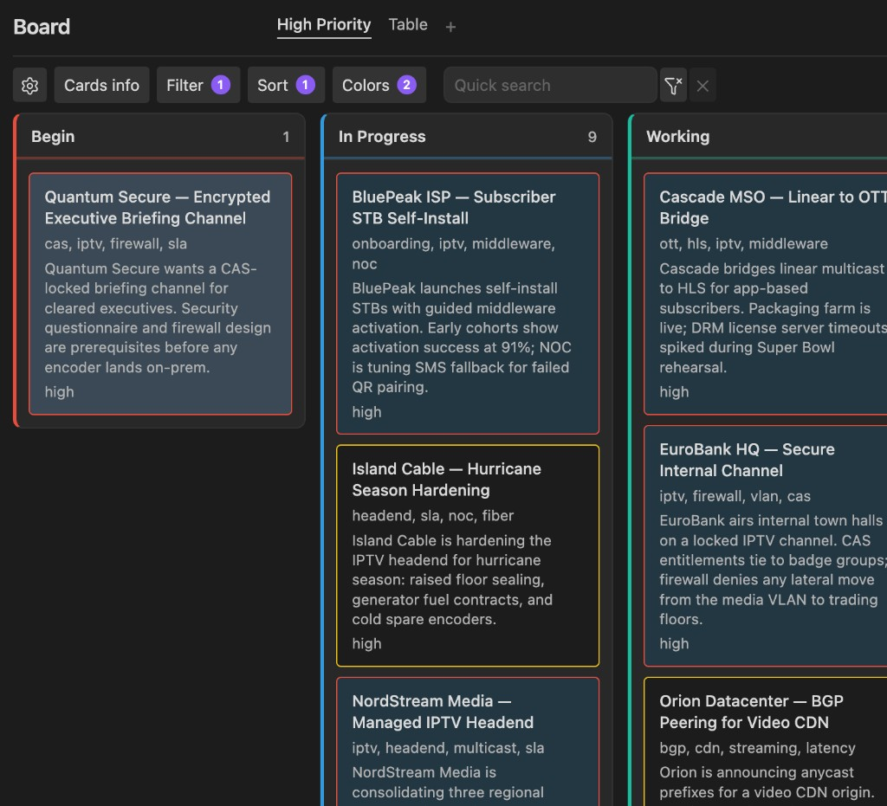
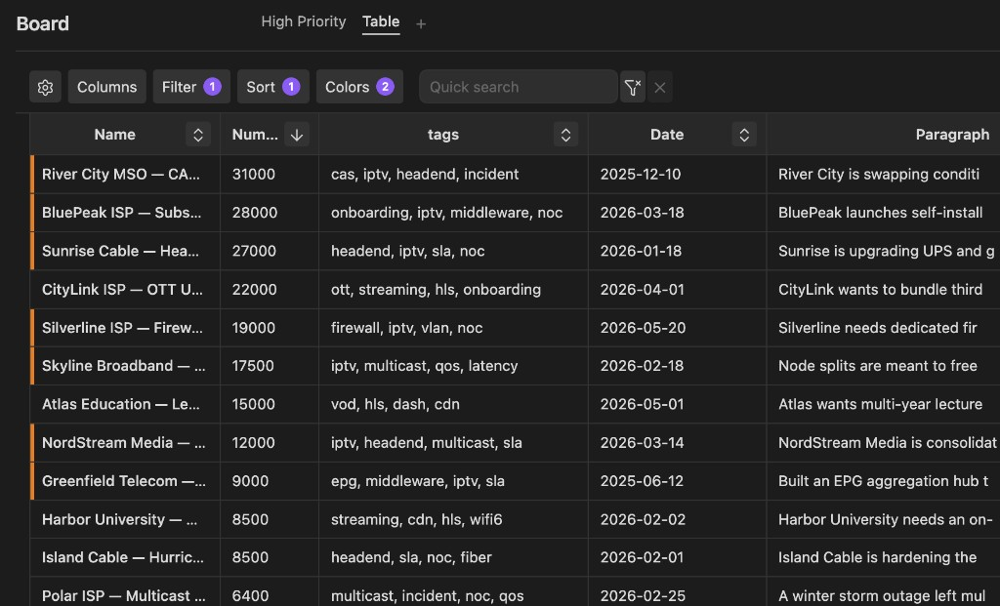

# Property Board

Build Kanban and table boards from your notes’ frontmatter properties.

Each board is a `.board` file in your vault. Pick a trigger property (for example `status`), and matching notes appear as cards or rows—grouped by that property’s values. Move a Kanban card to update the property on the note.

**Repository:** https://github.com/NaleVex/obsidian_property_dashboard





## Features

- **Boards as vault files** — Settings and views live in a `.board` file next to your notes, not buried in plugin settings
- **Properties as the source of truth** — Columns come from a frontmatter key; empty or unknown values land in an **Unknown** column
- **Kanban and table on one board** — Multiple named views share the same scope and trigger property
- **Rich card and column fields** — Show properties, file metadata, or slices of the note body (paragraph fields)

## Roadmap

- Card view
- Formula fields
- More language translations

Suggestions and issues are welcome.

## Installation

### Manual (development)

1. Clone this repository into your vault's `.obsidian/plugins/property-board/` folder.
2. Run `npm install` and `npm run dev` (or `npm run build` for production).
3. Enable **Property Board** under Settings → Community plugins.

> Always develop plugins in a separate dev vault, not your main vault.

## Usage

1. Create a board via the ribbon icon or command palette: **Create new board**.
2. Open the board file (or it opens automatically after create).
3. Use the header gear to configure:
   - **Trigger property** — frontmatter key used for grouping (e.g. `status`)
   - **Limit to** — entire vault, siblings of the board file, or a specific folder
   - **Values** — ordered column list (e.g. `todo`, `in-progress`, `done`)
4. Add frontmatter to notes you want on the board:

```yaml
---
status: in-progress
---
```

5. Add more Kanban or Table views with the **+** tab control if needed.

Notes without the trigger property are excluded. Notes with the property but an empty or unrecognized value appear in the **Unknown** column.

## Board file format

Boards are JSON files with a `.board` extension, for example:

```json
{
  "version": 1,
  "name": "New Board",
  "settings": {
    "triggerProperty": "status",
    "limitTo": { "mode": "all" },
    "values": ["todo", "in-progress", "done"]
  },
  "views": [
    { "id": "…", "type": "kanban", "name": "Kanban" }
  ],
  "activeViewId": "…"
}
```

`limitTo` modes:

| Mode | Meaning |
|---|---|
| `all` | All markdown notes in the vault |
| `siblings` | Notes in the same folder as the board file |
| `folder` | Notes under a specific vault folder path |

## Development

```bash
npm install
npm run dev    # watch mode
npm run build  # production bundle
```

### Deploy to test vault

```bash
npm run deploy
```

By default this builds the plugin and copies `main.js`, `manifest.json`, and `styles.css` to:

`vault/.obsidian/plugins/property-board/`

(in this repo’s local `vault/` folder)

Override the vault path:

```bash
OBSIDIAN_VAULT=/path/to/vault npm run deploy
# or
npm run deploy -- /path/to/vault
```

To copy without rebuilding (after `npm run dev`):

```bash
npm run deploy:skip-build
```

## License

Copyright (C) 2026 NaleVex.

This project is licensed under the GNU General Public License v3.0.
See [LICENSE](LICENSE) for the full text.

If you fork or redistribute this plugin, you must:
- Keep this project under GPL-3.0
- Preserve copyright and license notices
- Clearly state any changes you made
- Credit the original project: https://github.com/NaleVex/obsidian_property_dashboard

## Support

If you'd like to support this project, you can send crypto to:

<table>
  <tr>
    <td> BTC</td>
    <td><code>bc1q33r5yfcw9stjzkvs86qpmp6fclgt4mukm2q7m0</code></td>
  </tr>
  <tr>
    <td> ETH</td>
    <td><code>0x596E874308D59769820Cc4038645E43a603DecC1</code></td>
  </tr>
  <tr>
    <td> USDT (TRC-20)</td>
    <td><code>THXNhyPo9pwcEBUmUsWiLWDZ4BtqPSQbpC</code></td>
  </tr>
  <tr>
    <td> SOL</td>
    <td><code>EWAM8kDe3KwszupkitbtBhWJfEd1tbyjwCCEK1DgCfB</code></td>
  </tr>
  <tr>
    <td> TON (GRAM)</td>
    <td><code>UQCsPSejXHfRcnEgbxK0PLfUbbNnicK4Av8ldKHS80J-OPGu</code></td>
  </tr>
</table>

*If you'd like to use something else, please ask me.*
